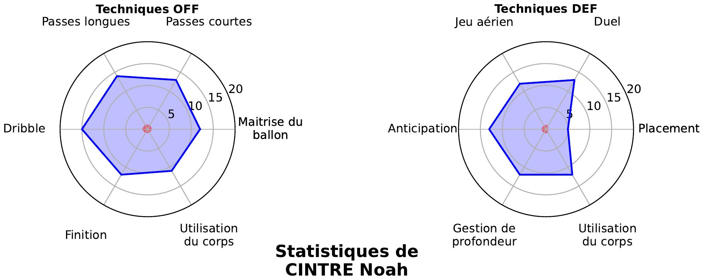

# MathisSportGraph



## Description

MathisSportGraph est un projet visant à analyser et visualiser des données sportives à l'aide de graphiques radar. Il permet de représenter différentes métriques sportives pour faciliter l'évaluation des performances.

## Fonctionnalités

- **Analyse de données** : Traitement et analyse des données sportives à partir de fichiers Excel.
- **Visualisation** : Génération de graphiques radar pour une représentation claire des performances.
- **Automatisation** : Scripts automatisés pour faciliter le flux de travail.

## Installation

1. Clonez le dépôt :

   ```bash
   git clone https://github.com/AmaelMSC/MathisSportGraph.git
   ```

2. Accédez au répertoire du projet :

   ```bash
   cd MathisSportGraph
   ```

## Utilisation

1. Assurez-vous que votre fichier de données sportives (Excel) est prêt.
2. **Lancez simplement** `start.bat` en double-cliquant dessus.
3. Les graphiques générés seront enregistrés dans le dossier **Joueurs/**.

## Licence

Ce projet est sous licence MIT. Voir le fichier [LICENSE](LICENSE) pour plus de détails.
